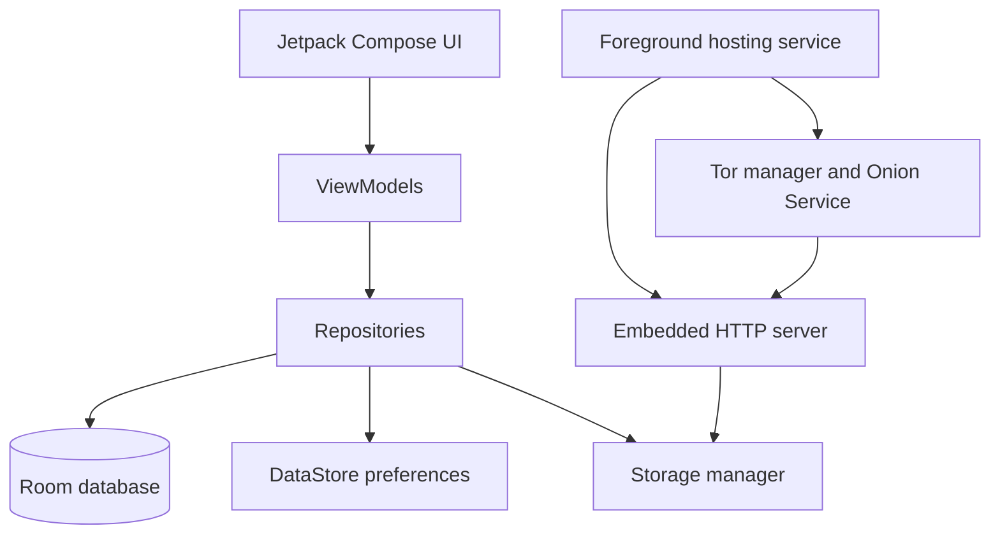

# OnionHost 🧅

OnionHost is an open-source Android app for serving static websites, documents, and media from a phone through a Tor v3 Onion Service. It also includes room-based anonymous chat that visitors can open in Tor Browser without installing the app or relying on a separate chat service.

[](releases/OnionHost-v1.1.0-debug.apk)

> **Current version:** 1.1.0 (version code 4) · **Minimum Android:** 8.0 (API 26)

## Download and install

**[Download OnionHost v1.1.0 debug APK](releases/OnionHost-v1.1.0-debug.apk)**

1. Download the APK to an Android 8.0+ device.
2. Open it from your file manager and approve Android's **Install unknown apps** prompt for that app, if asked.
3. Open OnionHost, import content, and start hosting.
4. Wait for the app to report that the Onion Service is live before sharing the generated `http://…onion/` address.
5. Visitors should open the address in a connected Tor Browser.

This is a debug-signed APK intended for testing. Android may show a warning when installing it. The host phone must remain powered on, connected to the internet, and free from restrictive battery optimization while hosting. OnionHost does not reserve a device-wide SOCKS port, so it can run alongside Tor Browser.

## Proof of concept


## Anonymous chat

Chat runs through the same Onion Service as the hosted site. Visitors only need the room link and Tor Browser.

### Create and share a room

1. Import content and start hosting.
2. Wait until the app shows **Hosting Live on Tor** and provides the Onion address.
3. Open the **Chat** tab, enter a room name, and select **Open**.
4. Select **Copy invite for this room** and share the copied link.

Invite links use either of these forms:

```text
http://your-onion-address.onion/chat/room-id
http://your-onion-address.onion/invite/room-id
```

Anyone with the complete link joins that room. Use a hard-to-guess room name and do not publish its link if you want to limit access. Browser visitors receive an automatically generated `Anon-xxxxxx` display name; messages refresh while the page is open.

### Chat limits and privacy

- Messages are stored in the app's private storage and restored after app, hosting, or device restarts. They are not stored with the hosted website files or in the Room database.
- A message is limited to 1,000 characters; each room retains up to 200 recent messages.
- Supported attachments are PNG, JPEG, GIF, WebP, MP4, WebM, MP3, OGG, and WAV, up to 5 MB. Other types, including HTML, SVG, scripts, and executables, are rejected.
- Visitors can delete messages they created in that browser; the host can delete any room message from the app.
- The service is available only while OnionHost is hosting and the phone is online.

## Features

- **Static hosting:** Import a folder, ZIP archive, or a single HTML, PDF, ISO, or APK file.
- **Embedded HTTP server:** Serves files with directory listings, MIME validation, byte-range requests, cache headers, and optional basic authentication.
- **Tor v3 Onion Service:** Starts Tor, creates or reuses an Onion address, and provides QR-code sharing.
- **Anonymous chat rooms:** Share a room-specific invite, exchange supported media, and manage messages from the app.
- **Local analytics:** Tracks visits, downloads, requested paths, and daily counts locally. No IP addresses or user-agent strings are recorded.
- **Foreground hosting:** Uses a foreground service and notification controls to keep hosting active; an auto-start-on-boot option is available.
- **Defensive file handling:** Uses isolated app storage, path-traversal checks, MIME validation, and request rate limiting.
- **Modern Android UI:** Built with Jetpack Compose and Material 3, with dark mode and dynamic color support.

## Architecture

OnionHost follows Clean Architecture and MVVM, with Hilt for dependency injection and Kotlin Coroutines/Flow for asynchronous work.



| Area | Responsibility |
| --- | --- |
| `ui/` | Compose screens for Home, Chat, Websites, Analytics, Logs, Settings, and About. |
| `hosting/` | Foreground service and boot receiver for the HTTP server and Tor process. |
| `http/` | Static-file serving, chat routes, chat media checks, and response security headers. |
| `tor/` | Tor configuration, Onion Service files, hostname extraction, and QR generation. |
| `storage/` and `security/` | Content import, ZIP extraction, path protection, MIME validation, and rate limiting. |
| `database/` and `analytics/` | Local website configuration, logs, and privacy-preserving usage statistics. |

## Project structure

```text
OnionHost/
├── app/
│   ├── src/main/java/com/onionhost/app/
│   │   ├── analytics/     # Local statistics
│   │   ├── database/      # Room database, DAOs, and entities
│   │   ├── hosting/       # Foreground service and boot receiver
│   │   ├── http/          # HTTP server and anonymous chat store
│   │   ├── security/      # Path and MIME safeguards; rate limiter
│   │   ├── storage/       # Content import and ZIP extraction
│   │   ├── tor/           # Tor and Onion Service management
│   │   └── ui/            # Compose UI and navigation
│   └── build.gradle.kts
├── releases/              # Versioned APK downloads
├── build.gradle.kts
└── README.md
```

## Build from source

Requirements: Android SDK with API 34, JDK 17, and an Android device or emulator running Android 8.0+.

```powershell
$env:ANDROID_HOME = "C:\\Users\\<you>\\AppData\\Local\\Android\\Sdk"
.\gradlew.bat :app:assembleDebug
```

The generated APK is at `app/build/outputs/apk/debug/app-debug.apk`.

## Security notes

- Hosted files are copied into the app's private storage before serving.
- Path traversal checks prevent requests from escaping the selected content root.
- Chat pages and API responses use restrictive no-store and content-security headers.
- The rate limiter defaults to 120 requests per minute for each address observed by the embedded server.
- Onion addresses and room links are sensitive access information. Share them only with intended visitors.

## Roadmap

- [ ] WebDAV and Git deployment support
- [ ] Multiple concurrent Onion Services
- [ ] Tor bridge configuration (obfs4/meek)
- [ ] Peer-to-peer website replication and distributed hosting
- [ ] Dynamic server and WebSocket support

## Contributing

1. Fork the repository.
2. Create a branch: `git checkout -b feature/amazing-feature`.
3. Commit your changes.
4. Push the branch and open a pull request.

## License

The app identifies itself as MIT-licensed. Add a `LICENSE` file before distributing the repository as an open-source project so the full license text is available to users and contributors.

## Created by

[Security Talent](https://securitytalent.net)
