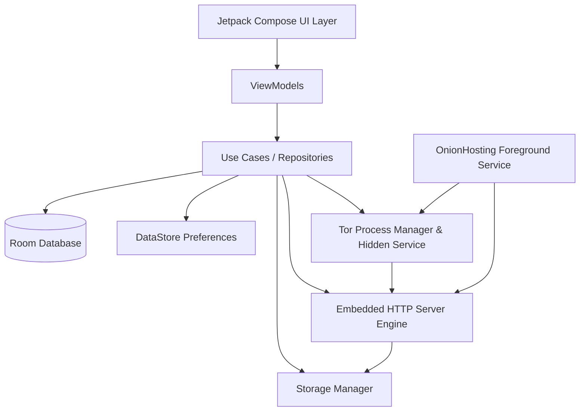

# OnionHost 🧅

**OnionHost** is a production-ready, open-source Android application that enables non-technical and advanced users alike to host static websites, documents, media files, and archives directly from their smartphone over the **Tor Network** using v3 Onion Services.

[](releases/OnionHost-v1.0.1-debug.apk)

📥 **[Download Latest OnionHost APK (v1.0.1)](releases/OnionHost-v1.0.1-debug.apk)** (Debug APK for Android 8+)

---

## Download and Tor Browser access

1. Install the APK and allow installation from the selected file manager when Android asks.
2. Import a website and start hosting. Do not share the address until the app reports that the onion-service descriptor has been published.
3. Open the generated `http://…onion/` address only in a connected Tor Browser.

OnionHost does not reserve a device-wide SOCKS port, so it can run alongside Tor Browser. The phone must remain powered on, connected to the internet, and exempt from battery restrictions while hosting.

---

## 🌟 Key Features

* **1-Tap Hosting Flow**: Select a folder, ZIP archive, or single HTML/PDF/ISO/APK file and start hosting immediately.
* **Embedded HTTP Engine**: High-performance HTTP server supporting static files, auto directory indexing, MIME validation, range requests (HTTP 206), cache headers, and basic authentication.
* **Tor v3 Integration**: Automated Tor bootstrapping, v3 Onion address generation, persistent Hidden Service key management, and QR code sharing.
* **Privacy-First Analytics**: Local-only statistics (visits, downloads, requested paths, daily counts). **Zero IP address logging**.
* **Android Foreground Service**: Uninterrupted background hosting with status notifications and quick control actions (Stop, Restart).
* **Auto-Start on Boot**: Option to resume web hosting automatically after device reboot.
* **Defense-in-Depth Security**: Path traversal protection, directory escape guards, MIME type sanitization, rate limiting, and read-only website mode.
* **Material Design 3**: Modern UI with dark mode, dynamic colors, smooth transitions, and responsive layouts built with Jetpack Compose.

---

## 🏗️ Software Architecture

OnionHost adheres to **Clean Architecture**, **MVVM (Model-View-ViewModel)**, and **SOLID Principles**, utilizing **Hilt** for dependency injection and **Coroutines / Flow** for asynchronous data handling.



### Layer Breakdown

1. **UI Layer (`ui/`)**: Built entirely with Jetpack Compose & Material 3. Contains `HomeScreen`, `WebsitesScreen`, `AnalyticsScreen`, `LogsScreen`, `SettingsScreen`, and `AboutScreen`.
2. **Foreground Service (`hosting/`)**: Manages the persistent runtime of the HTTP server and Tor process, handling OS battery optimizations and status notifications.
3. **HTTP Engine (`http/`)**: Embedded NanoHTTPD server with path-traversal sanitization, rate-limiting, range request handling, and basic authorization support.
4. **Tor Controller (`tor/`)**: Configures `torrc`, manages Hidden Service directories (`hs_website`), extracts `.onion` hostnames, and generates QR code bitmaps.
5. **Storage & Security (`storage/` & `security/`)**: Safe file import/extraction, path traversal sanitization, MIME verification, and rate limiting.
6. **Data & Analytics (`database/` & `analytics/`)**: Local-only Room database storing website configurations, system console logs, and privacy-preserving stats.

---

## 📂 Project Structure

```
OnionHost/
├── app/
│   ├── build.gradle.kts
│   ├── src/
│   │   ├── main/
│   │   │   ├── AndroidManifest.xml
│   │   │   ├── java/com/onionhost/app/
│   │   │   │   ├── analytics/       # Privacy-preserving stats tracker
│   │   │   │   ├── common/          # Extensions, Result wrappers, QR generator
│   │   │   │   ├── database/        # Room Database, DAOs, Entities
│   │   │   │   ├── di/              # Dagger Hilt Modules
│   │   │   │   ├── hosting/         # Foreground Service & Boot Receiver
│   │   │   │   ├── http/            # Embedded HTTP Server Engine
│   │   │   │   ├── repository/      # Data Repositories & DataStore
│   │   │   │   ├── security/        # Path Traversal Guard, Rate Limiter
│   │   │   │   ├── storage/         # Storage Manager & ZIP extractor
│   │   │   │   ├── tor/             # Tor Manager & Hidden Service Controller
│   │   │   │   ├── ui/              # Compose Screens, Navigation, Theme
│   │   │   │   └── OnionHostApplication.kt
│   │   │   └── res/                 # Layouts, XML configs, Icons
│   │   └── test/                    # Unit & Integration Tests
├── build.gradle.kts
├── settings.gradle.kts
├── gradle.properties
└── README.md
```

---

## 🔒 Security Model

* **Path Traversal Guard**: Prevents `../` or URL-encoded path escape attacks by validating canonical paths against isolated app storage boundaries (`PathTraversalSanitizer.kt`).
* **Rate Limiting**: Restricts maximum requests per minute per client connection (`RateLimiter.kt`).
* **Isolated File Access**: Uploaded website contents are strictly copied into sandboxed app storage before serving.
* **Zero IP Logging**: Visitor statistics record only anonymous endpoint metrics without recording client IP addresses or user agent signatures.

---

## 🚀 Future Roadmap

- [ ] WebDAV & Git Deployment support
- [ ] Multiple concurrent Onion Services
- [ ] Tor Bridge (obfs4/meek) configuration
- [ ] P2P Website Replication & Distributed Hosting
- [ ] Dynamic Web Server & WebSocket support

---

## 🤝 Contribution Guide

Contributions are welcome! Please follow these steps:
1. Fork the repository.
2. Create your feature branch (`git checkout -b feature/amazing-feature`).
3. Commit your changes (`git commit -m 'Add amazing feature'`).
4. Push to the branch (`git push origin feature/amazing-feature`).
5. Open a Pull Request.

---

## 📄 License

Distributed under the MIT License. See `LICENSE` for more information.
