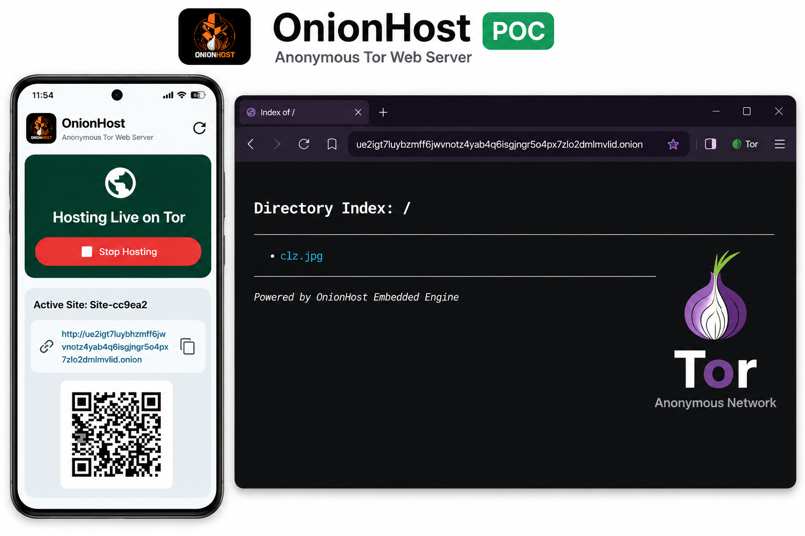
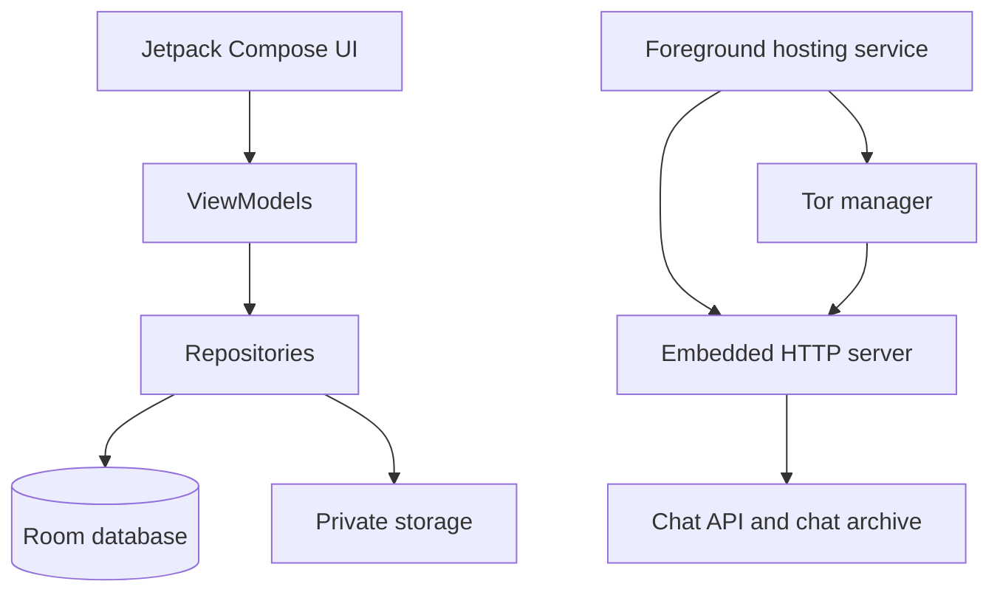

# OnionHost

OnionHost turns an Android phone into a private static-file server published as a Tor v3 Onion Service. Import a website, document, or media file, start hosting, and share the generated `.onion` address with visitors using Tor Browser. It also includes anonymous one-to-one chats and named group rooms served directly from the same Onion Service.

[](https://github.com/SecurityTalent/OnionHost/raw/main/releases/OnionHost-latest.apk)

> **Current source version:** 1.1.1 (version code 5) · **Minimum Android:** 8.0 / API 26

## Proof of concept (POC)

The screenshot below shows the complete flow: OnionHost is hosting on the phone, the generated Onion address and QR code are visible, and Tor Browser is opening the hosted directory.



## Download and install

**[Download the latest installable APK](https://github.com/SecurityTalent/OnionHost/raw/main/releases/OnionHost-latest.apk)**

The link always points to `releases/OnionHost-latest.apk` on the `main` branch. Replace that one file whenever a new build is published, and the README button will download the new version without changing the link.

1. Download the APK on an Android 8.0+ device.
2. Open the downloaded file and allow installation from the app you used to download it, if Android asks.
3. Start OnionHost, import content, and select **Start hosting**.
4. Wait until the status says that the Onion Service is live.
5. Share the displayed `http://…onion/` address. Visitors must open it with Tor Browser.

The checked-in latest APK is a debug-signed build for testing. For public production distribution, create a release build signed with your own persistent private keystore; the production-signing section below explains this. Keep the host phone powered, online, and excluded from aggressive battery optimization while it is hosting.

## Hosting a site or file

1. In **Home**, select one of the import options:
   - **Choose Folder** for a complete static site.
   - **Choose ZIP File** to import and safely extract a site archive.
   - **Choose Single File** for an HTML file, document, APK, ISO, image, or media file.
2. OnionHost copies the content into private app storage.
3. Start hosting and wait for Tor bootstrap and hidden-service publication to finish.
4. Copy the Onion address or scan/download its QR code.
5. Stop or restart hosting from the app or its foreground notification.

The HTTP server supports directory listings when no `index.html` exists, safe MIME types, download headers for downloadable files, and byte-range requests for supported media. Optional basic authentication can be configured per website.

## QR code sharing

The Home screen shows a QR code for the active website's Onion address.

- Tap the QR code, or press **Download QR Code**, to choose a location and save it as a PNG.
- The copy icon next to the Onion address copies only the website address.
- Chat links are intentionally managed from the Chat screen, because every personal chat and room has its own separate link.

## Anonymous chat

Chat is served by OnionHost itself. No third-party chat server, phone number, or visitor account is required. A visitor needs Tor Browser and the specific link you share.

### Personal chat tab

Use **Personal chat** for one-to-one conversations.

1. Select **New personal chat link**.
2. Copy the icon beside that personal chat.
3. Share the link only with the intended person.
4. Select a saved personal chat name to open its messages.

Personal conversations stay separate from group rooms. While the Personal chat tab is open, room messages cannot be viewed or sent.

### Rooms tab

Use **Rooms** for group conversations.

1. Enter a room name, for example `room1`, `room2`, or `friends`.
2. Press **Create**. The room name immediately appears under **Your rooms**, even before its first message.
3. Tap a room name to open that room.
4. Press the copy icon on the right of that room to copy its own unique link.
5. Anyone who opens the same room link can join that room and chat with the group.

Each room has a different URL in this form:

```text
http://your-onion-address.onion/chat/room-room1
```

Room messages stay in their own room. While the Rooms tab is open, personal messages cannot be viewed or sent.

### Sending, attachments, activity, and history

- Browser users receive an automatically generated anonymous name.
- The green dot shows active users who have recently connected to the currently selected conversation.
- Browser chat displays a loading spinner while the chat is loading or reconnecting.
- Text messages support up to 1,000 characters.
- Supported attachments are PNG, JPEG, GIF, WebP, MP4, WebM, MP3, OGG, and WAV, up to 5 MB.
- The host can delete any message; a browser visitor can delete messages created in that browser.
- The newest messages appear at the bottom. Scroll upward to read earlier messages.
- Saved personal-chat and room lists have a fixed height, so they do not shrink the message area when many chats exist.

### Persistence and limits

- Messages and room names are saved in the app's private storage, not inside hosted website files.
- A primary archive and local backup archive are written on every chat change. If an interrupted write damages the primary archive, the backup is restored on the next launch.
- Chats survive hosting restarts, app restarts, and normal device restarts. Clearing Android app data or uninstalling the app removes locally stored chats.
- Each room retains the latest 200 messages to keep memory use bounded.
- A private link is an access secret, not end-to-end encryption. Use unpredictable room names and do not publish links you want to keep private.

## Other app functions

| Screen | What it does |
| --- | --- |
| **Home** | Starts/stops/restarts hosting, displays the Onion address, copies the site address, and saves the address QR code. |
| **Chat** | Manages fully separated personal chats and group rooms, their links, messages, attachments, activity indicators, and deletion. |
| **Websites** | Shows imported websites and lets you choose the active hosted content. |
| **Analytics** | Shows local visits, downloads, paths, and daily statistics. No IP addresses or user-agent strings are stored. |
| **Logs** | Shows application, HTTP, and Tor status messages to help diagnose startup or publication problems. |
| **Settings** | Stores app preferences, including hosting-related settings. |
| **About** | Shows application information. |

## Security and privacy

- Content is imported into app-private storage before serving.
- Path-traversal protection prevents a request from escaping the hosted content root.
- MIME validation restricts served and chat-uploaded content types.
- Chat pages and APIs use no-store cache headers and a restrictive content-security policy.
- The embedded server rate-limits requests per observed address.
- Tor creates and owns the v3 hidden-service key material; OnionHost does not generate a fake Onion address.
- An Onion address only becomes shareable after Tor reports that its service descriptor has been published.

## Build from source

Requirements: Android SDK API 34, JDK 17, and Android 8.0+ for running the app.

```powershell
$env:ANDROID_HOME = "C:\Users\<you>\AppData\Local\Android\Sdk"
.\gradlew.bat :app:assembleDebug
```

The debug APK is created at `app/build/outputs/apk/debug/app-debug.apk`.

### Publish the current latest APK

Run this task after building and testing a debug APK:

```powershell
.\gradlew.bat :app:publishLatestApk
```

It updates `releases/OnionHost-latest.apk`, which is the file used by the README download button. Commit and push that file with the source changes to publish the new downloadable build.

### Production-signed APK

Production updates must always use the same private signing key. Do not commit that key. Create an untracked `keystore.properties` file in the repository root:

```properties
storeFile=C:\secure\onionhost-release.jks
storePassword=your-store-password
keyAlias=onionhost
keyPassword=your-key-password
```

Then run:

```powershell
.\gradlew.bat :app:publishProductionApk
```

This task uses the release build and publishes the signed result as `releases/OnionHost-latest.apk`. If the signing properties are absent, it deliberately does not publish a release APK.

## Architecture



| Area | Responsibility |
| --- | --- |
| `ui/` | Compose screens, navigation, hosting controls, chat, and QR download UI. |
| `hosting/` | Foreground service and boot receiver. |
| `http/` | Static-file routes, chat pages/API, response headers, and media validation. |
| `tor/` | Tor process, hidden-service configuration, publication status, and Onion hostname handling. |
| `storage/` and `security/` | Content import, ZIP extraction, MIME checks, path safety, and rate limiting. |
| `database/` and `analytics/` | Local website configuration, logs, and privacy-preserving statistics. |

## Responsible Use

OnionHost is intended for legitimate privacy-preserving hosting,
development, testing, research, and communication purposes.

Users are responsible for everything they publish or share through
their own Onion Service. The developers and maintainers do not
endorse or authorize unlawful use of the software.

## License

The app identifies itself as MIT-licensed. Add a complete `LICENSE` file before public distribution.

Created by [Security Talent](https://securitytalent.net).
